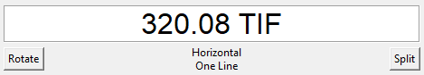
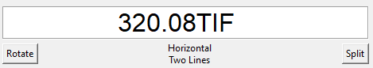
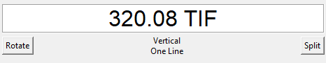

# AlmaPrintGrid : Application for printing items call numbers by scanning barcodes


**Status** : to be continued...

---

## Goals

Scan items barcodes, retrieve items callnumbers from **Exlibris Alma API** and populate a ready-to-print grid template.

## Development

### Install 

```
git clone https://github.com/gegedenice/alma-print-grid.git
```

### Environment variables

- Copy the .sample.env file nad rename in .env.
- Fill with your Alma API Key

### Virtualenv

Create a virtualenv 

Windows
```
python -m venv .venv
cd .venv/Scripts & activate
```
Linux

```
python3 -m venv .venv
source .venv/bin/activate
```

Then `pip install -r requirements.txt`

### Run

`python app.py`

## Build package with cx_Freeze

The  command
```
python setup.py build
```
compiles the files and generates a `build` folder with the executable app.exe inside.

## How it works

- In dev mode  : call numbers data are coming from the `dummy_item_data.json` file and not the Alma API.

  Press Enter ky in each cell to fill a popup with whatever value, the `AlmaClient.dummy_search_item` method is then called and returns the value "320.08 TIF" from the dummy_item_data.json file.

  
  
- To test with scanning barcodes and requesting Alma items API : 
  - in `app.py`, change the `item_value = AlmaClient.dummy_search_item(format="call-number",item_barcode=barcode)` 

    line in the `process_barcode` function to

    `item_value = AlmaClient.search_item(format="call-number",item_barcode=barcode)`
  - in `app.py`, remplace `barcode = simpledialog.askstring("Scan   Barcode", "Please enter the barcode:")` with 
    `barcode = self.entries[self.current_row][self.current_col].get().strip()`

- Features : each cell can be populated with a value, that can then be rotated or split on 2 lines for printing (with the buttons under each cell). The way values are finally displayed cannot be see in the UI but only by previewing the resulting pdf. Instead, a "state" is displayed under each cell according to the user actions on the "rotate " and "split" buttons







### Todo

- when splitting the callnumber, the second part is displayed in first place, eg "DIFF \n 325.3" instead of "325.3 \n DIFF"

